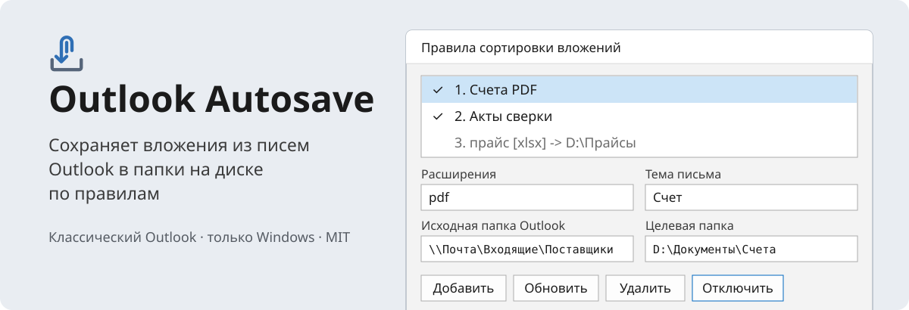
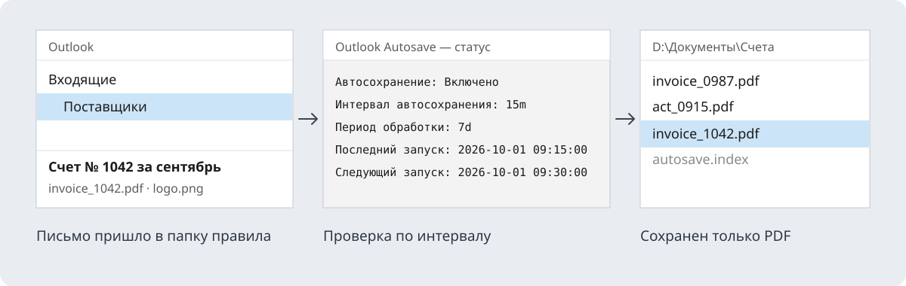

<p align="center">
  
</p>

<p align="center">
  <a href="LICENSE"></a>
  
  
</p>

<h3 align="center">Письма удаляются — вложения остаются.</h3>

**Outlook Autosave** — бесплатная надстройка для классического Outlook, только для Windows. Она сама раскладывает вложения из писем по папкам на диске: по таймеру или по кнопке, по правилам, которые вы задаете один раз.

- **Автосохранение по правилам.** Правило отбирает вложения по тексту в имени файла, расширению, теме письма и папке Outlook и сохраняет их в нужную папку.
- **Без дублей.** Уже сохраненные вложения не выгружаются повторно, даже если файл потом удалили или расширили период поиска.
- **Сохранение выбранных писем.** Кнопка на ленте и пункт контекстного меню сохраняют все вложения из выделенных писем в одну папку.
- **Без прав администратора.** Установка из MSI только для текущего пользователя.

## Кому пригодится

Всем, кто регулярно получает документы по почте и вручную раскладывает их по папкам.

| Кто | Пример правила |
| --- | --- |
| **Бухгалтеры и финансисты** | Счета и акты от поставщиков: `pdf`, тема «Счет» → `D:\Бухгалтерия\Счета`; акты сверки — в отдельную папку |
| **Закупки и снабжение** | Коммерческие предложения и прайс-листы: `xlsx, pdf` из папки «Поставщики» → общая папка закупок |
| **Логистика и склад** | Накладные, ТТН, отчеты перевозчиков: текст в имени файла `ТТН` → `\\server\Логистика\ТТН`; по правилу на каждого перевозчика, если нужно раздельно |
| **Юристы и договорной отдел** | Договоры и допсоглашения: `docx, pdf`, тема «Договор» → папка договоров |
| **Аналитики** | Ежедневные отчеты из учетных систем, которые приходят письмом: `xlsx, csv` → папка, откуда их забирает Excel или Power BI |
| **Руководители и секретари** | Все вложения из выбранных писем одной кнопкой — в папку проекта или на сетевой диск |

Целевой папкой может быть сетевой диск (`\\server\share\...`) или папка, которая синхронизируется с облаком, — тогда документы сразу видны коллегам.

<!--
Скриншоты: положите файлы в assets/readme/ и раскомментируйте блок.

<p align="center">
  
  
</p>
-->

## Как это работает

<p align="center">
  
</p>

Надстройка сохраняет вложения сразу, как только письмо появилось в исходной папке, а проверка по таймеру раз в интервал пересматривает письма за последний период и подхватывает то, что могло проскочить. Каждое вложение проходит по списку правил сверху вниз и сохраняется по первому подходящему; если у правила включено `Продолжить проверку следующих правил`, вложение сохраняется и по следующим подходящим правилам — например, отчет может попасть и в папку отчетов, и в общую папку PDF. Сохраненные вложения записываются в скрытый файл `autosave.index` в целевой папке, поэтому повторные запуски не создают копий. Если файл с таким именем уже есть, новое вложение сохраняется с датой письма в имени, например `invoice_2026-05-22_14-30-00.pdf`.

## Установка

**Платформа: только Windows.** Outlook для Mac, Outlook в браузере, «новый Outlook» для Windows и мобильные приложения не поддерживаются: в них нет COM-надстроек.

**Требования:** Windows 10/11 (64-бит), классический Outlook 2016/2019/2021/2024 или Microsoft 365 (32- или 64-битный), .NET Framework 4.8 (встроен в Windows 10 1903+ и Windows 11).

Протестировано: Windows 11, Office 2024 (классический Outlook).

1. Закройте Outlook.
2. Скачайте `OutlookAutosave-<версия>.msi` со страницы [Releases](../../releases/latest), запустите его, примите условия лицензии и нажмите `Установить`. Установка идет в `%LOCALAPPDATA%\Programs\OutlookAutosave`.
3. Откройте Outlook. На вкладке `Главная` появится группа `Outlook Autosave` с кнопками `Настройки` и `Сохранить выбранные`.

Установщик пока не подписан сертификатом издателя, поэтому Windows SmartScreen может показать `Windows защитила ваш компьютер`. Нажмите `Подробнее -> Выполнить в любом случае`.

### Где найти установленную надстройку

- **В Outlook:** вкладка `Главная`, группа `Outlook Autosave`. Список надстроек: `Файл -> Параметры -> Надстройки`. В столбце `Расположение` у надстройки указан `mscoree.dll` — это нормально для надстроек на .NET.
- **Файлы:** `%LOCALAPPDATA%\Programs\OutlookAutosave` — вставьте этот путь в адресную строку Проводника.
- **В списке программ Windows:** `Outlook Autosave`. Пакет ставится для одного пользователя, поэтому в списке он виден только тому, кто его установил.

## Быстрый старт

1. `Главная -> Outlook Autosave -> Настройки -> Правила`.
2. Заполните правило:
   - `Исходная папка Outlook` — кнопка `Выбрать` или `Текущая`;
   - `Расширения`, например `pdf`, и при необходимости `Тема письма` или `Текст в имени файла`;
   - `Целевая папка` — кнопка `Обзор`.
3. Нажмите `Добавить`, затем `Сохранить`.
4. На главной форме задайте `Интервал` (как часто проверять, например `15m`) и `Период` (сколько последних дней каждая проверка пересматривает заново, например `3d`; глубокий период — только для разового `Запустить`).
5. Нажмите `Включить`. Первый прогон выполнится сразу, следующие — по интервалу.

Подробное описание всех форм, полей и статусов лога — в [руководстве пользователя](docs/usage.md).

## Переход с VBA-версии

Надстройка читает те же настройки, что и макрос (`HKCU\Software\VB and VBA Program Settings\OutlookAttachmentSaver\Settings`): правила, интервал, период и отметки запусков подхватываются автоматически. Файлы `autosave.index` и `autosave.log` тоже совместимы, поэтому уже сохраненные вложения повторно не выгружаются.

Перед первым запуском надстройки удалите макрос, иначе автосохранение будет выполняться дважды:

1. В Outlook нажмите `Alt + F11`.
2. Удалите модули и формы Outlook Autosave (`MainModule`, `AutoSaveSettingsUi`, `SortRulesSettingsCore`, формы `*Form`).
3. Уберите вызов `AutoSaveStartup` из `ThisOutlookSession`.
4. Сохраните проект и перезапустите Outlook.
5. Уберите с ленты старые кнопки макросов, если добавляли их.

## Удаление

1. Закройте Outlook.
2. Удалите программу одним из способов:
   - **Windows 11:** `Параметры -> Приложения -> Установленные приложения`, найдите `Outlook Autosave`, нажмите `⋯ -> Удалить`;
   - **Windows 10:** `Параметры -> Приложения -> Приложения и возможности -> Outlook Autosave -> Удалить`;
   - **Панель управления:** `Win + R -> appwiz.cpl`, выберите `Outlook Autosave` и нажмите `Удалить`;
   - **Файл установщика:** щелкните по `OutlookAutosave-<версия>.msi` правой кнопкой мыши и выберите `Удалить`.
3. Откройте Outlook: группы `Outlook Autosave` на ленте больше нет.

Тихое удаление, например для администраторов:

```bat
msiexec /x OutlookAutosave-<версия>.msi /qn /norestart
```

**Что удаляется:** файлы надстройки и ее регистрация в Windows и Outlook.

**Что остается:**

- сохраненные вложения, а также `autosave.index` и `autosave.log` в целевых папках — надстройка их не трогает;
- настройки и правила в реестре — на случай повторной установки.

Чтобы удалить и настройки, выполните после удаления программы:

```bat
reg delete "HKCU\Software\VB and VBA Program Settings\OutlookAttachmentSaver" /f
```

Те же настройки использует VBA-версия макроса: если она еще установлена, ее правила тоже пропадут.

**Отключить, не удаляя:** `Файл -> Параметры -> Надстройки -> Управление: Надстройки COM -> Перейти`, снимите флажок `Outlook Autosave`. Чтобы включить снова, поставьте флажок обратно.

Если надстройка регистрировалась для отладки через `tools\dev-register.ps1`, в списке программ ее не будет. Удалите регистрацию командой `powershell -ExecutionPolicy Bypass -File .\tools\dev-register.ps1 -Unregister` из папки `addin`.

## Ограничения

- **Только папка правила.** Вложения ищутся в самой исходной папке, без вложенных папок.
- **Локальный кеш Outlook.** Период не может быть больше того, что Outlook хранит локально. Если в режиме кеширования Exchange включено хранение за 12 месяцев, период `700d` не даст доступ к более старым письмам. Увеличить кеш: `Файл -> Настройка учетных записей -> Настройка учетных записей -> Изменить -> Скачать электронную почту за последние`.
- **Outlook должен быть запущен.** Автосохранение работает внутри Outlook: пока он закрыт, письма не проверяются. После запуска Outlook надстройка обработает все письма, пришедшие за время простоя (например, за отпуск), даже если простой длиннее периода, — делать ничего не нужно.
- **Большие папки.** За один прогон проверяется не более 10 000 писем, чтобы Outlook не подвисал. Если писем за период больше, обработка продолжается порциями раз в минуту с места остановки, пока не дойдет до новых писем.
- **Без подписи кода.** В домене с AppLocker или политиками Office, блокирующими неуправляемые надстройки, может потребоваться разрешение администратора для ProgID `OutlookAutosave.Connect`.

Если группа не появилась на ленте: `Файл -> Параметры -> Надстройки -> Управление: Надстройки COM -> Перейти`, отметьте `Outlook Autosave`. Если надстройка в списке `Отключенные элементы`, включите ее там же.

## Безопасность

Код полностью открыт под лицензией MIT. Администратор может проверить его, собрать MSI сам и отдать на аудит именно ту сборку, которую будет раскатывать.

**Что делает надстройка:**

- Работает только внутри Outlook текущего пользователя, через его объектную модель. Отдельных служб, планировщика задач и автозапуска нет.
- Читает письма только из исходных папок активных правил и сохраняет вложения только в целевые папки правил и в папку для выбранных писем.
- Не обращается к сети: в коде нет HTTP-запросов, телеметрии и обновлений через интернет.
- Не отправляет, не перемещает, не изменяет и не удаляет письма и другие элементы Outlook.
- Имена вложений очищаются от символов пути (`\ / : * ? " < > |`), поэтому файл не может записаться за пределы целевой папки.
- Во время работы не использует сторонних библиотек: нужны только Windows, .NET Framework 4.8 и Outlook.

**Что меняется в системе при установке.** Все изменения касаются только текущего пользователя и удаляются вместе с программой, кроме настроек:

| Где | Что |
| --- | --- |
| `%LOCALAPPDATA%\Programs\OutlookAutosave\` | `OutlookAutosave.dll`, `LICENSE.txt` |
| `HKCU\Software\Classes\OutlookAutosave.Connect`, `HKCU\Software\Classes\CLSID\{6F0E8E54-3B7C-4E0B-9C51-2B7A3C1D5E10}` (и та же запись в `Wow6432Node`) | Регистрация COM-класса надстройки |
| `HKCU\Software\Microsoft\Office\Outlook\Addins\OutlookAutosave.Connect` | Регистрация надстройки в Outlook |
| `HKCU\Software\Microsoft\Office\16.0\Outlook\Resiliency\DoNotDisableAddinList` | Запрет Outlook отключать надстройку из-за времени запуска .NET |
| `HKCU\Software\f0nwa\OutlookAutosave` | Служебные отметки установщика |
| `HKCU\Software\VB and VBA Program Settings\OutlookAttachmentSaver\Settings` | Настройки и правила (создаются при работе, при удалении остаются) |

В целевых папках правил надстройка создает скрытый `autosave.index` и, если включено логирование, `autosave.log`.

**Где смотреть при аудите:**

| Файл | Что в нем |
| --- | --- |
| `addin/src/OutlookAutosave/Core/AutoSaveEngine.vb` | Все операции с файлами: сохранение вложений, индекс, лог |
| `addin/src/OutlookAutosave/Core/OutlookHost.vb` | Все обращения к Outlook |
| `addin/src/OutlookAutosave/Core/SettingsStore.vb` | Все обращения к реестру во время работы |
| `addin/installer/Package.wxs` | Полный список файлов и ключей реестра, которые пишет MSI |

**Сборка и подпись своим сертификатом.** Соберите надстройку из проверенного исходного кода, подпишите DLL сертификатом организации, затем соберите и подпишите MSI:

```powershell
cd addin
dotnet build src\OutlookAutosave\OutlookAutosave.vbproj -c Release
signtool sign /fd SHA256 /tr http://timestamp.digicert.com /td SHA256 /a src\OutlookAutosave\bin\Release\net48\OutlookAutosave.dll
dotnet build installer\OutlookAutosave.Installer.wixproj -c Release -p:Platform=x64
Get-ChildItem installer\bin\x64\Release -Recurse -Filter *.msi | ForEach-Object { signtool sign /fd SHA256 /tr http://timestamp.digicert.com /td SHA256 /a $_.FullName }
```

Адрес сервера метки времени замените на тот, что принят в организации. Подписанный MSI можно раскатывать через групповые политики, SCCM или Intune. Если в Office включен список разрешенных надстроек, добавьте в него ProgID `OutlookAutosave.Connect`.

О найденных уязвимостях сообщайте владельцу репозитория приватно, а не в открытых Issues; подробнее — в [SECURITY.md](SECURITY.md).

## Сборка из исходников

Visual Studio не нужна. На Windows нужен [.NET SDK 8](https://dotnet.microsoft.com/download) и доступ к nuget.org (WiX Toolset и референсные сборки .NET Framework скачиваются при сборке).

```powershell
winget install Microsoft.DotNet.SDK.8
cd addin
powershell -ExecutionPolicy Bypass -File .\build.ps1
```

Установщик появится в `addin\dist\OutlookAutosave-<версия>.msi`. Версия задается в [`addin/Directory.Build.props`](addin/Directory.Build.props).

Отладка без установщика (Outlook должен быть закрыт):

```powershell
powershell -ExecutionPolicy Bypass -File .\tools\dev-register.ps1              # зарегистрировать собранную DLL
powershell -ExecutionPolicy Bypass -File .\tools\dev-register.ps1 -Unregister  # отменить регистрацию
```

Диагностика пишется через `System.Diagnostics.Trace` с префиксом `OutlookAutosave:` — ее можно смотреть в [DebugView](https://learn.microsoft.com/sysinternals/downloads/debugview).

Workflow GitHub Actions [`.github/workflows/build.yml`](.github/workflows/build.yml) собирает MSI на `windows-latest` при каждом push и прикладывает его к артефактам сборки.

<details>
<summary>Структура проекта</summary>

| Путь | Назначение |
| --- | --- |
| `addin/src/OutlookAutosave/Connect.vb` | Точка входа COM-надстройки, лента и контекстное меню |
| `addin/src/OutlookAutosave/Core/AutoSaveEngine.vb` | Автосохранение по правилам, таймер, индекс, лог, сохранение выбранных писем |
| `addin/src/OutlookAutosave/Core/SortRules.vb` | Модель, нормализация и хранение правил |
| `addin/src/OutlookAutosave/Core/OutlookHost.vb` | Доступ к Outlook через позднее связывание, без Office PIA |
| `addin/src/OutlookAutosave/Core/SettingsStore.vb` | Настройки в реестре, совместимые с VBA-версией |
| `addin/src/OutlookAutosave/Core/TextUtil.vb` | Интервалы, имена файлов, расширения |
| `addin/src/OutlookAutosave/UI/` | Формы: главная, настройки выбранных, правила, выбор папки Outlook |
| `addin/src/OutlookAutosave/Interop/NativeInterfaces.vb` | COM-интерфейсы Office и Windows |
| `addin/installer/Package.wxs` | MSI: файлы, COM-регистрация в HKCU, регистрация надстройки |
| `addin/build.ps1` | Сборка DLL и MSI |
| `addin/tools/dev-register.ps1` | Регистрация для отладки без MSI |
| `docs/usage.md` | Руководство пользователя |
| `vba/` | Исходная VBA-версия 1.0.x, см. [vba/README.md](vba/README.md) |

</details>

## Лицензия

[MIT](LICENSE). Сборка использует .NET SDK (MIT) и [WiX Toolset v5](https://wixtoolset.org/) (MS-RL).
